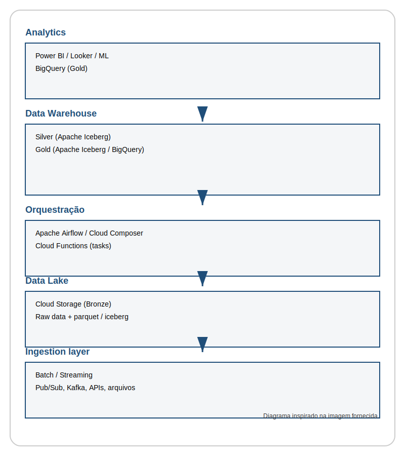

# Arquitetura Lakehouse

Este repositório contém a estrutura inicial para executar a arquitetura Lakehouse descrita.

## Diagrama de arquitetura

## Estrutura do projeto

- `infra/` - infraestrutura como código (Terraform) para criar recursos no Google Cloud.
- `dags/` - DAGs do Apache Airflow / Cloud Composer.
- `src/` - código Python para ingestão e transformação de dados.
- `docs/` - documentação e diagramas.

## Próximos passos

1. Ajustar os templates em `infra/` para o projeto e credenciais do GCP.
2. Adicionar DAGs em `dags/` conforme o fluxo de ingestão/transformação.
3. Implementar lógica de ingestão/transformação em `src/`.
4. Usar GitHub Actions / Cloud Build para CI/CD.
